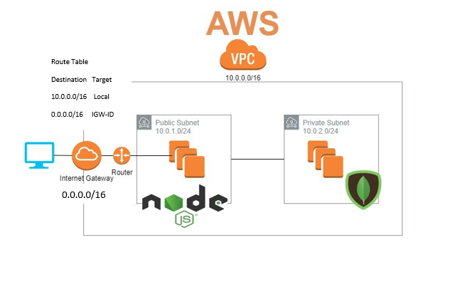
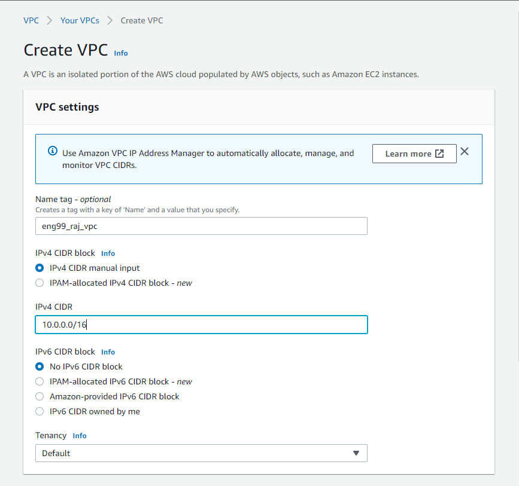
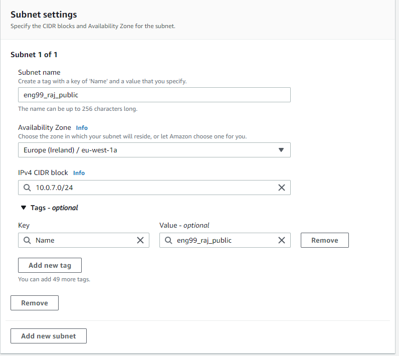
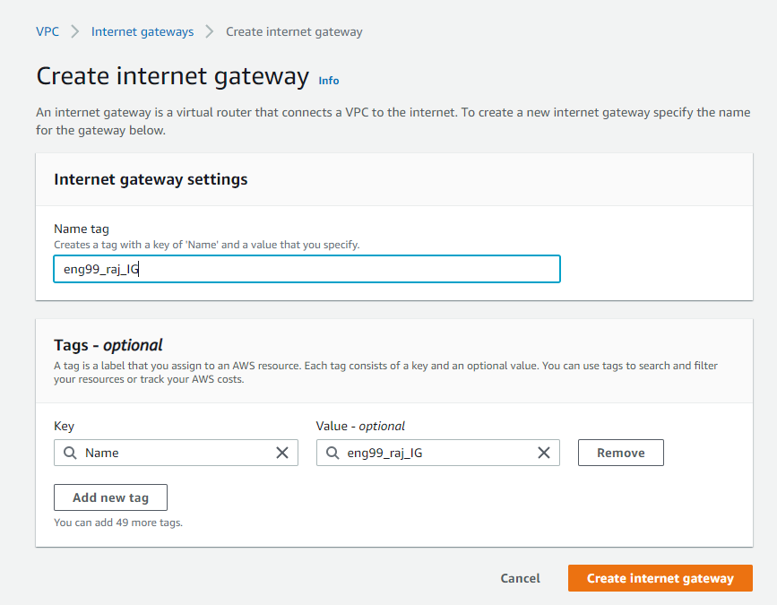
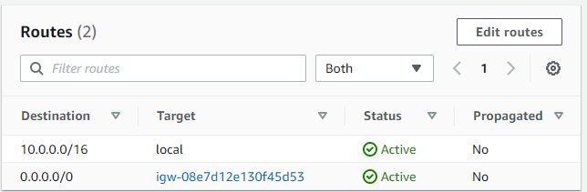
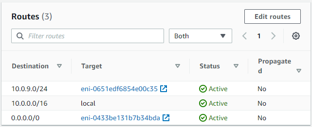

# AWS Networking
## VPC
### 2 Tier Architecture Deployment

**AWS Networking**
- IP Addresses
- CIDR Blocks
- IPv4 and IPv6

**VPC and its resources**

- Creation of VPC, Subnets, Internet Gateway, Route Tables, Instances within VPC and their locations, app in public subnet, db in private subnet, differences between these subnets, security group rules. 
- **VPC** 
    - Inside AWS, navigate to the VPC service and launch a VPC, decalre the name and the CIDR block which will be 10.0.0.0/16
    
- **Subnets**
    - Create a public subnet with the CIDR block 10.0.7.0/24
    - Create a private subnet with the CIDR block 10.0.8.0/24
    
- **Internet Gateway**
    - very simple to launch, just creat an Internet Gateway and give it a name, no other configuration is required.
    
- **Route Table Rules**
    - Two route tables, one for public subnet and another for the private subnet.
    - Public subnet route table will have two routes, one for the local VPC (10.0.0.0/16) and another for the Internet Gateway (0.0.0.0/16) to internet communication.
    
    - Private subnet will have route within VPC (and NAT Instance) does not have a route for Internet Gateway as private subnet needs to be hidden and not accessed directly.
     
- **VPC Instances**
    - Create new DB and app instances from the AMI's.
    The App VPC AMI security group rules allows port 22 on your IP, port 80 anywhere on IPv4 and port 3000 anywhere on IPv4
    DB VPC AMI security group rules allow port 27017 for IP of public subnet. 

- Subnet CIDR Blocks
- Connectivity between app and db and app nat db

**2 Tier Architecture Deployment in our own VPC**

- should have all rules at all levels required

**Include everything else covered with AWS**
